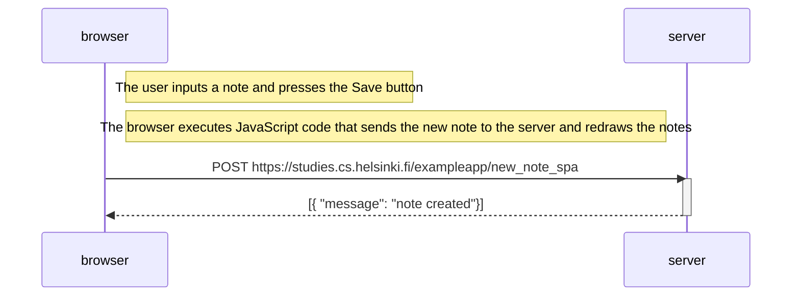

```mermaid
sequenceDiagram
    participant browser
    participant server

    Note right of browser: The user inputs a note and presses the Save button
    Note right of browser: The browser executes JavaScript code that sends the new note to the server and redraws the notes
    browser->>server: POST https://studies.cs.helsinki.fi/exampleapp/new_note_spa
    activate server
    server-->>browser: [{ "message": "note created"}]
    deactivate server
```